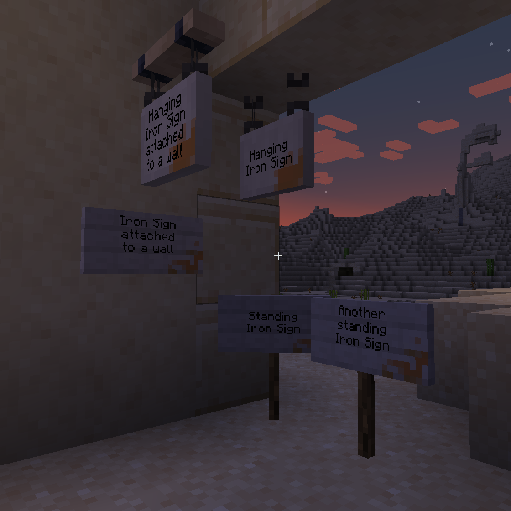
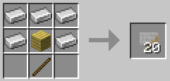
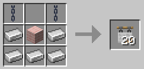
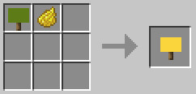
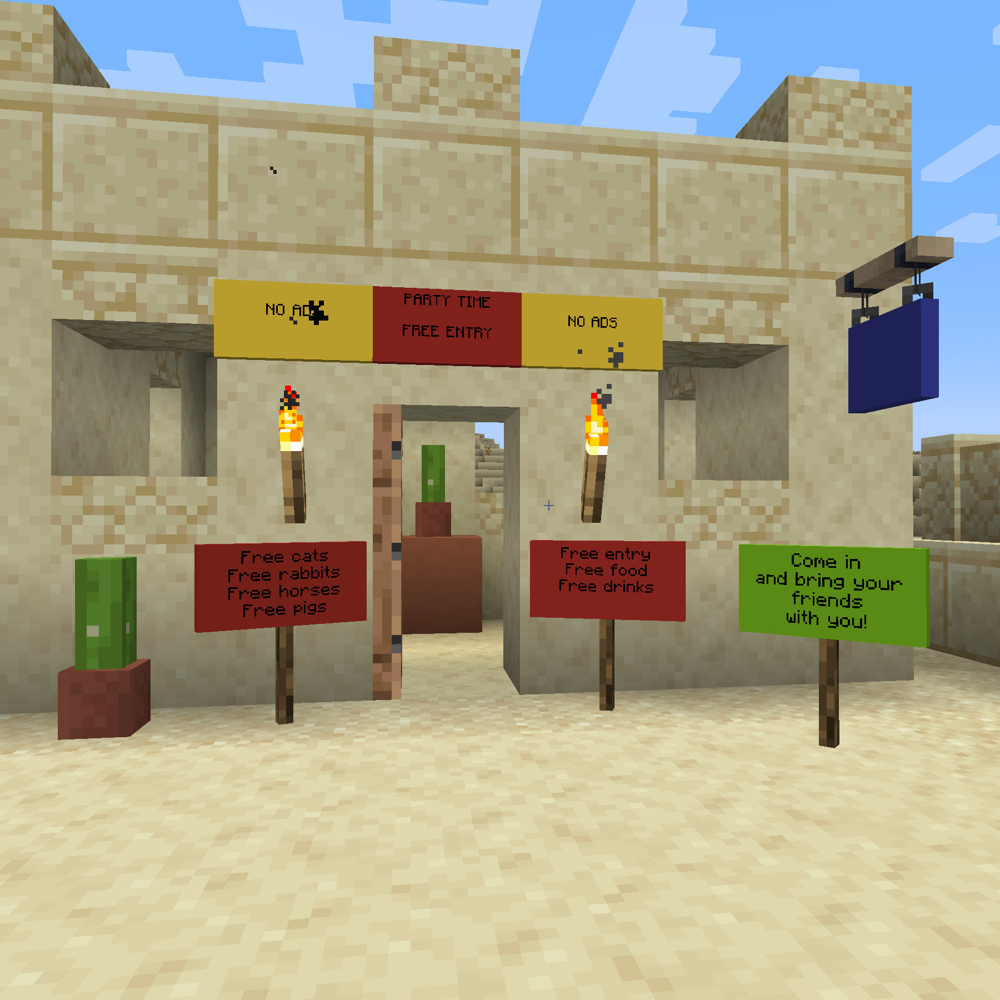
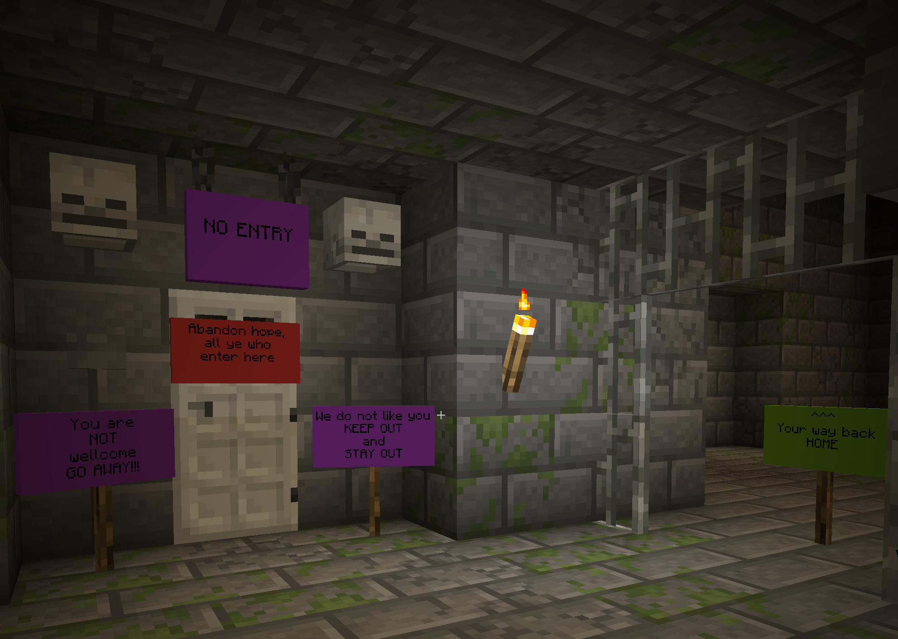

# Iron Signs (Fabric)  

Iron Signs themselves are not much better than Vanilla wooden signs. They are inexpensive, and stack up to 64, but They are just dull gray, slightly rusted places of iron plates.

Their crafting recipes are similar to the Vanilla wooden signs:  

  

But Iron Signs can be painted to all the colors of Minecraft:

Or even more efficiently, at the time of their creation:

The vibrant, high contrast, painted signs then can be used to convey information to your friends: 

Or to your enemies:

## Requires

- [Fabric API](https://modrinth.com/mod/fabric-api)  

## License

Standard MIT license. Feel free to learn from it and incorporate it in your own projects.

## Source code

Available on [GitLab](https://gitlab.com/pintergabor/ironsigns.git) or on [GitHub](https://github.com/pinter-gabor-at/IronSigns.git).

## For developers

Quite often, when I start learning programming on a new platform, I find even the simplest examples too complicated.
Tutorials, written by experts, with years of experience programming on that platform, sometimes forget how difficult those first step are.
This is why I decided to make my first Minecraft mods publicly available.

The project is still in BETA, because it has not been tested in large modpacks and on large servers. Feedback is welcome.  
[Email: Pintér Gábor <pinter.gabor@gmx.at>](mailto://pinter.gabor@gmx.at)

## Future plans

- Pointer Signs
- Colored and styled text
- Forge port (only after the Fabric version is feature complete)

## Thanks

Thanks to Kaupenjoe for his excellent [Modding By Kaupenjoe: Minecraft Modding 1.20.X for Fabric](https://www.udemy.com/course/minecraft-modding-120x-for-fabric/) course.
