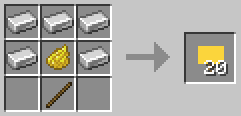

# Iron Signs (Fabric and NeoForge)  

Iron Signs themselves are not much better than Vanilla wooden signs. They are inexpensive, and stack up to 64, but they are just dull gray, slightly rusted pieces of iron plates.

Their crafting recipes are similar to the Vanilla wooden signs:  

  

But Iron Signs can be painted to all the colors of Minecraft:

Or, even more efficiently, at the time of their creation:

The vibrant, high contrast, painted signs then can be used to convey information to your friends: 

Or to your enemies:

Or to your customers:

Since 1.0.2 with sign text coloring and formatting: 

## Requires (Fabric)

- [Fabric API](https://modrinth.com/mod/fabric-api)  
- [Cloth Config API](https://modrinth.com/mod/cloth-config)
- Optional, but recommended [Mod Menu](https://modrinth.com/mod/modmenu)

## License

Standard MIT license. Feel free to learn from it and incorporate it in your own projects.  
Some parts of the code are based on the source code of [Text Utilities](https://github.com/ChristopherHaws/mc-text-utilities), which is LGPL-3 licensed. 

## Source code

Available on [GitLab](https://gitlab.com/pintergabor/ironsigns.git) or on [GitHub](https://github.com/pinter-gabor-at/IronSigns.git).

## For developers

The mod has not been extensively tested in large modpacks and on large servers. Feedback is welcome.  
[Email: Pintér Gábor <pinter.gabor@gmx.at>](mailto://pinter.gabor@gmx.at)

## Future plans

- Pointer Signs

## Thanks

Thanks to Kaupenjoe for his excellent [Modding By Kaupenjoe: Minecraft Modding 1.20.X for Fabric](https://www.udemy.com/course/minecraft-modding-120x-for-fabric/) course.  
Thanks to [Chaws](https://modrinth.com/user/Chaws) for making available the source code of [Text Utilities](https://modrinth.com/mod/text-utilities).

## See also

My other mods on [Modrinth](https://modrinth.com/user/pinter.gabor) and on [CurseForge](https://www.curseforge.com/members/pintergabor/projects).
